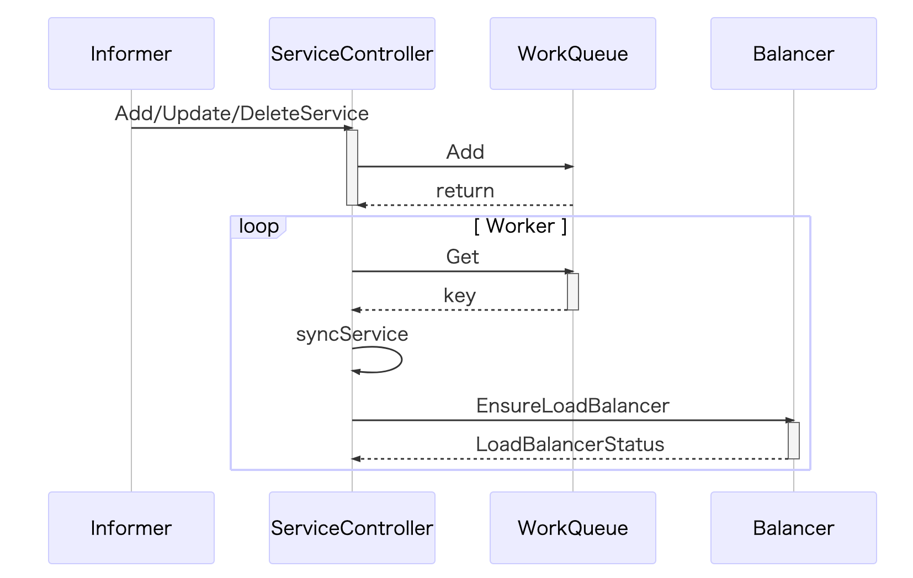
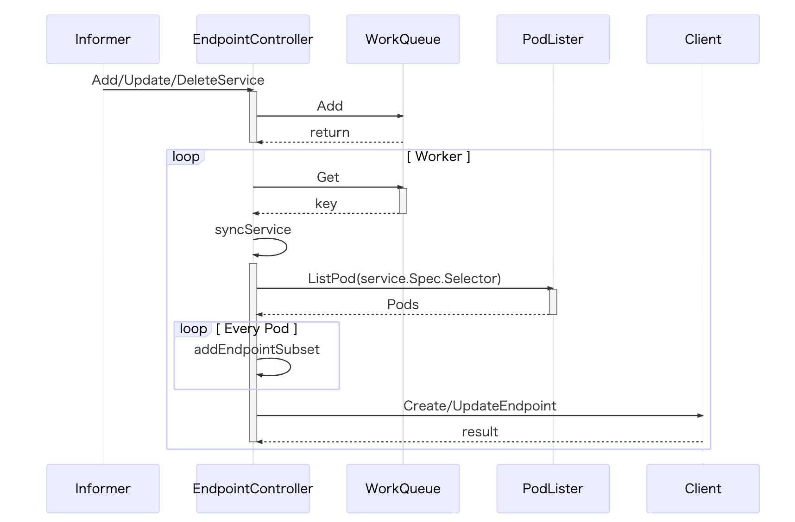
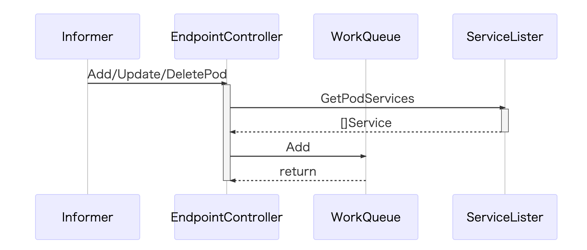
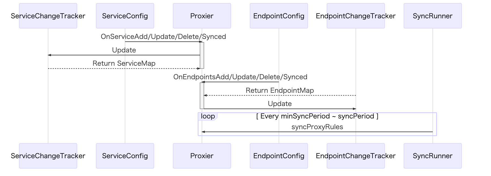
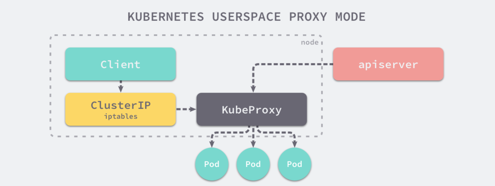
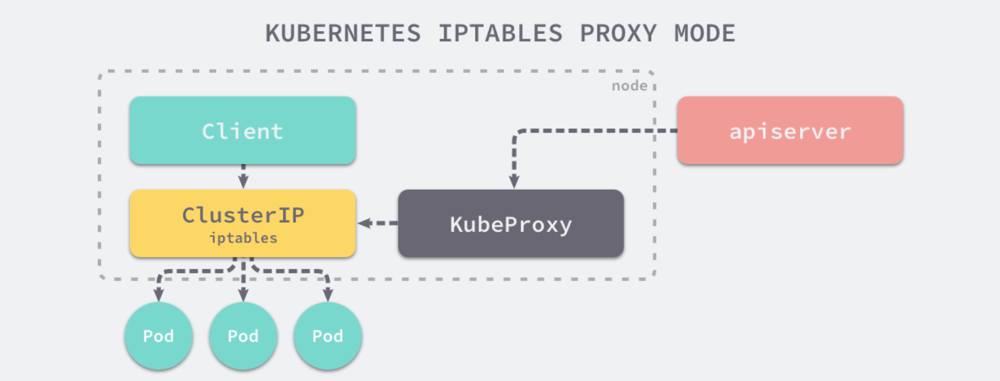
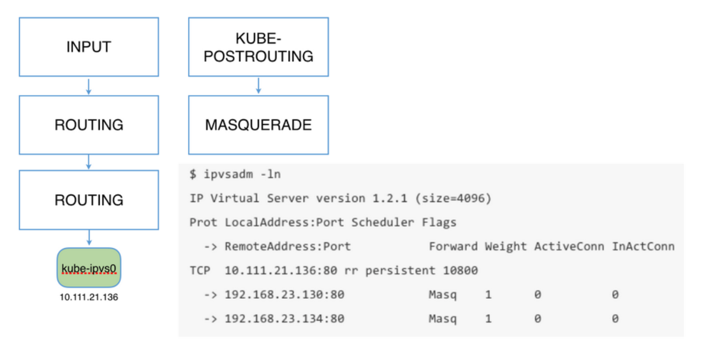
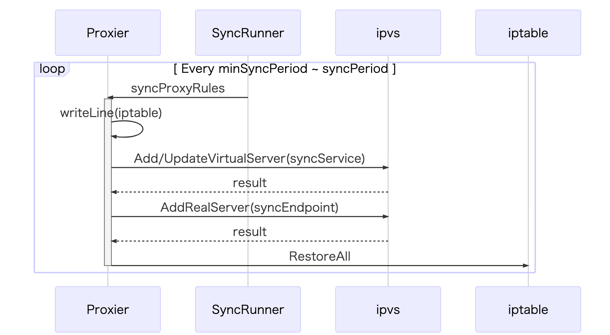

# Service

**Service是将运行在一组 Pods 上的应用程序公开为网络服务的抽象方法。  
使用Kubernetes，您无需修改应用程序即可使用不熟悉的服务发现机制。  
Kubernetes为Pods提供自己的IP地址和一组Pod的单个DNS名称，并且可以在它们之间进行负载平衡。**

## 创建服务

在 Kubernetes 中创建一个新的 Service 对象需要两大模块同时协作，其中一个模块是控制器，它需要在每次客户端创建新的 Service 对象时，生成其他用于暴露一组 Pod 的 Kubernetes 对象，也就是 Endpoint 对象；  
另一个模块是 kube-proxy，它运行在 Kubernetes 集群中的每一个节点上，会根据 Service 和 Endpoint 的变动改变节点上 iptables 或者 ipvs 中保存的规则。  

## 控制器

控制器模块其实总共有两个部分监听了 Service 变动的事件，其中一个是 ServiceController、另一个是 EndpointController，我们分别来看两者如何应对 Service 的变动。

### Service controller

可以先来看一下 ServiceController 在 Service 对象变动时发生了什么事情，每当有服务被创建或者销毁时，Informer 都会通知 ServiceController，它会将这些任务投入工作队列中并由其本身启动的 Worker 协程消费：

### Endpoint controller

ServiceController 主要处理的还是与 LoadBalancer 相关的逻辑，但是 EndpointController 的作用就没有这么简单了，我们在使用 Kubernetes 时虽然很少会直接与 Endpoint 资源打交道，但是它却是 Kubernetes 中非常重要的组成部分。

EndpointController 本身并没有通过 Informer 监听 Endpoint 资源的变动，但是它却同时订阅了 Service 和 Pod 资源的增删事件，对于 Service 资源来讲，EndpointController 会通过以下的方式进行处理：

EndpointController 中的 syncService 方法时用于创建和删除 Endpoint 资源最重要的方法，在这个方法中我们会根据 Service 对象规格中的选择器 Selector 获取集群中存在的所有 Pod，并将 Service 和 Pod 上的端口进行映射生成一个 EndpointPort 结构体

对于每一个 Pod 都会生成一个新的 EndpointSubset，其中包含了 Pod 的 IP 地址和端口和 Service 的规格中指定的输入端口和目标端口，在最后 EndpointSubset 的数据会被重新打包并通过客户端创建一个新的 Endpoint 资源。

在上面我们已经提到过，除了 Service 的变动会触发 Endpoint 的改变之外，Pod 对象的增删也会触发 EndpointController 中的回调函数。

getPodServiceMemberships 会获取跟当前 Pod 有关的 Service 对象并将所有的 Service 对象都转换成 <namespace>/<name> 的字符串
这些服务最后会被加入 EndpointController 的队列中，等待它持有的几个 Worker 对 Service 进行同步。

这些其实就是 EndpointController 的作用，订阅 Pod 和 Service 对象的变更，并根据当前集群中的对象生成 Endpoint 对象将两者进行关联.

## kube-proxy 代理

在整个集群中另一个订阅 Service 对象变动的组件就是 kube-proxy 了，每当 kube-proxy 在新的节点上启动时都会初始化一个 ServiceConfig 对象，就像介绍 iptables 代理模式时提到的，这个对象会接受 Service 的变更事件：

这些变更事件都会被订阅了集群中对象变动的 ServiceConfig 和 EndpointConfig 对象推送给启动的 Proxier.  
收到事件变动的 Proxier 实例随后会根据启动时的配置更新 iptables 或者 ipvs 中的规则，这些应用最终会负责对进出的流量进行转发并完成一些负载均衡相关的任务。

## 代理模式

在 Kubernetes 集群中的每一个节点都运行着一个 kube-proxy 进程，这个进程会负责监听 Kubernetes 主节点中 Service 的增加和删除事件并修改运行代理的配置，为节点内的客户端提供流量的转发和负载均衡等功能，但是当前 kube-proxy 的代理模式目前来看有三种。
这三种代理模式中的第一种 userspace 其实就是运行在用户空间代理，所有的流量最终都会通过 kube-proxy 本身转发给其他的服务，后两种 iptable 和 ipvs 都运行在内核空间能够为 Kubernetes 集群提供更加强大的性能支持。

### 版本兼容性

从Kubernetes v1.0开始，您已经可以使用 用户空间代理模式。 Kubernetes v1.1添加了 iptables 模式代理，
在 Kubernetes v1.2 中，kube-proxy 的 iptables 模式成为默认设置。  
Kubernetes v1.8添加了 ipvs 代理模式。  

#### userspace 代理模式

这种模式，kube-proxy 会监视 Kubernetes master 对 Service 对象和 Endpoints 对象的添加和移除.  
对每个 Service，它会在本地 Node 上打开一个端口（随机选择）。  
任何连接到“代理端口”的请求，都会被代理到 Service 的backend Pods 中的某个上面（如 Endpoints 所报告的一样）。  
使用哪个 backend Pod，是 kube-proxy 基于 SessionAffinity 来确定的.  

如果当前节点上的 kube-proxy 在启动时选择了 userspace 模式，那么每当有新的 Service 被创建时，kube-proxy 就会增加一条 iptables 记录并启动一个 Goroutine，前者用于将节点中服务对外发出的流量转发给 kube-proxy，再由后者持有的一系列 Goroutine 将流量转发到目标的 Pod 上。  
这一系列的工作大都是在 OnServiceAdd 被触发时中完成的，正如上面所说的，该方法会调用 mergeService 将传入服务 Service 的端口变成一条 iptables 的配置命令为当前节点增加一条规则，同时在 addServiceOnPort 方法中启动一个 TCP 或 UDP 的 Socket。  

#### iptables

另一种常见的代理模式就是直接使用 iptables 转发当前节点上的全部流量，这种脱离了用户空间在内核空间中实现转发的方式能够极大地提高 proxy 的效率，增加 kube-proxy 的吞吐量。iptables 作为一种代理模式，它同样实现了 OnServiceUpdate、OnEndpointsUpdate 等方法，这两个方法会分别调用相应的变更追踪对象。  
变更追踪对象会根据 Service 或 Endpoint 对象的前后变化改变 ServiceChangeTracker 本身的状态，这些变更会每隔一段时间通过一个 700 行的巨大方法 syncProxyRules 同步，在这里就不介绍这个方法的具体实现了，它的主要功能就是根据 Service 和 Endpoint 对象的变更生成一条一条的 iptables 规则.  
当我们使用 iptables 的方式启动节点上的代理时，所有的流量都会先经过 PREROUTING 或者 OUTPUT 链，随后进入 Kubernetes 自定义的链入口 KUBE-SERVICES、单个 Service 对应的链 KUBE-SVC-XXXX 以及每个 Pod 对应的链 KUBE-SEP-XXXX，经过这些链的处理，最终才能够访问当一个服务的真实 IP 地址。  

虽然相比于用户空间来说，直接运行在内核态的 iptables 能够增加代理的吞吐量，但是当集群中的节点数量非常多时，iptables 并不能达到生产级别的可用性要求，每次对规则进行匹配时都会遍历 iptables 中的所有 Service 链。  

规则的更新也不是增量式的，当集群中的 Service 达到 5,000 个，每增加一条规则都需要耗时 11min，当集群中的 Service 达到 20,000 个时，每增加一条规则都需要消耗 5h 的时间，这也就是告诉我们在大规模集群中使用 iptables 作为代理模式是完全不可用的。  

#### ipvs(IP Virtual Server)

作为 Linux Virtual Server(LVS) 项目的一部分，IPVS 是建立于 Netfilter之上的高效四层负载均衡器，支持 TCP 和 UDP 协议，支持3种负载均衡模式：NAT、直接路由（通过 MAC 重写实现二层路由）和IP 隧道。ipvs(IP Virtual Server)安装在LVS(Linux Virtual Server)集群作为负载均衡主节点上，通过虚拟出一个IP地址和端口对外提供服务。客户端通过访问虚拟IP+端口访问该虚拟服务，之后访问请求由负载均衡器调度到后端真实服务器上。
ipvs相当于工作在netfilter中的input链。  

ipvs转发模式  
● DR模式（Direct Routing）  

特点：  
<1> 数据包在LB转发过程中，源/目的IP和端口都不会变化。LB只修改数据包的MAC地址为RS的MAC地址  
<2> RS须在环回网卡上绑定LB的虚拟机服务IP  
<3> RS处理完请求后，响应包直接回给客户端，不再经过LB  
缺点：  
<1> LB和RS必须位于同一子网  
● NAT模式（Network Address Translation）  

特点：  
<1> LB会修改数据包地址：对于请求包，进行DNAT；对于响应包，进行SNAT  
<2> 需要将RS的默认网关地址配置为LB的虚拟IP地址  
缺点：  
<1> LB和RS必须位于同一子网，且客户端和LB不能位于同一子网  

● FULLNAT模式  

特点：  
<1> LB会对请求包和响应包都做SNAT+DNAT  
<2> LB和RS对于组网结构没有要求  
<3> LB和RS必须位于同一子网，且客户端和LB不能位于同一子网  

● 三种转发模式性能从高到低：DR > NAT >FULLNAT  

ipvs 就是用于解决在大量 Service 时，iptables 规则同步变得不可用的性能问题。与 iptables 比较像的是，ipvs 的实现虽然也基于 netfilter 的钩子函数，但是它却使用哈希表作为底层的数据结构并且工作在内核态，这也就是说 ipvs 在重定向流量和同步代理规则有着更好的性能。

在处理 Service 的变化时，ipvs 包和 iptables 其实就有非常相似了，它们都同样使用 ServiceChangeTracker 对象来追踪变更，只是两者对于同步变更的方法 syncProxyRules 实现上有一些不同.

从 ipvs 的源代码和上述的时序图中可以看到，Kubernetes ipvs 的实现其实是依赖于 iptables 的，后者能够辅助它完成一些功能，使用 ipvs 相比 iptables 能够减少节点上的 iptables 规则数量，这也是因为 ipvs 接管了原来存储在 iptables 中的规则。

除了能够提升性能之外，ipvs 也提供了多种类型的负载均衡算法，除了最常见的 Round-Robin 之外，还支持最小连接、目标哈希、最小延迟等算法，能够很好地提升负载均衡的效率。

### ipvs 负载均衡器常用调度算法

● 轮询（Round Robin)  
LB认为集群内每台RS都是相同的，会轮流进行调度分发。从数据统计上看，RR模式是调度最均衡的。  
● 加权轮询（Weighted Round Robin）  
LB会根据RS上配置的权重，将消息按权重比分发到不同的RS上。可以给性能更好的RS节点配置更高的权重，提升集群整体的性能。  
● 最少连接调度  
LB会根据和集群内每台RS的连接数统计情况，将消息调度到连接数最少的RS节点上。在长连接业务场景下，LC算法对于系统整体负载均衡的情况较好；但是在短连接业务场景下，由于连接会迅速释放，可能会导致消息每次都调度到同一个RS节点，造成严重的负载不均衡。  
● 加权最少连接调度  
最小连接数算法的加权版。  
● 原地址哈希，锁定请求的用户  
根据请求的源IP，作为散列键（Hash Key）从静态分配的散列表中找出对应的服务器。若该服务器是可用的且未超载，将请求发送到该服务器。

### ipvs与iptables的性能差异

随着服务的数量增长，IPTables 规则则会成倍增长，这样带来的问题是路由延迟带来的服务访问延迟，同时添加或删除一条规则也有较大延迟。不同规模下，kube-proxy添加一条规则所需时间如下所示

<table>
<tr><td>services</td><td>1</td><td>5000</td><td>20000</td></tr>
<tr><td>rule</td><td>8</td><td>40000</td><td>160000</td></tr>
<tr><td>Iptables</td><td>2ms</td><td>11min</td><td>5 hour</td></tr>
<tr><td>IPVS</td><td>2ms</td><td>2ms</td><td>2ms</td></tr>
</table>

可以看出当集群中服务数量达到5千个时，路由延迟成倍增加。添加 IPTables 规则的延迟，有多种产生的原因，如：

添加规则不是增量的，而是先把当前所有规则都拷贝出来，再做修改然后再把修改后的规则保存回去，这样一个过程的结果就是 IPTables 在更新一条规则时会把 IPTables 锁住，这样的后果在服务数量达到一定量级的时候，性能基本不可接受：在有5千个服务（4万条规则）时，添加一条规则耗时11分钟；在右2万个服务（16万条规则）时，添加一条规则需要5个小时。

这样的延迟时间，对生产环境是不可以的，那该性能问题有哪些解决方案呢？从根本上解决的话，可以使用 “IP Virtual Server”(IPVS )来替换当前 kube-proxy 中的 IPTables 实现，这样能带来显著的性能提升以及更智能的负载均衡功能如支持权重、支持重试等等。
