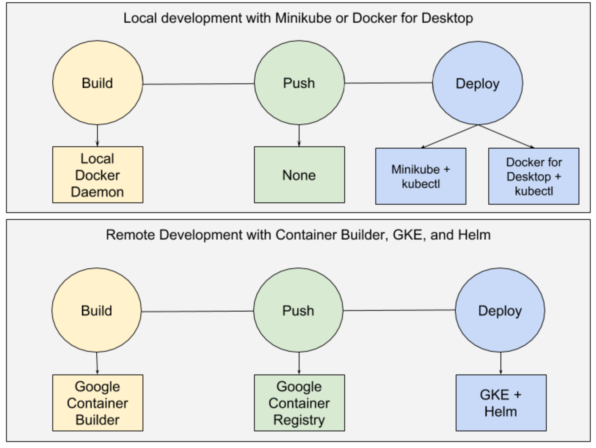
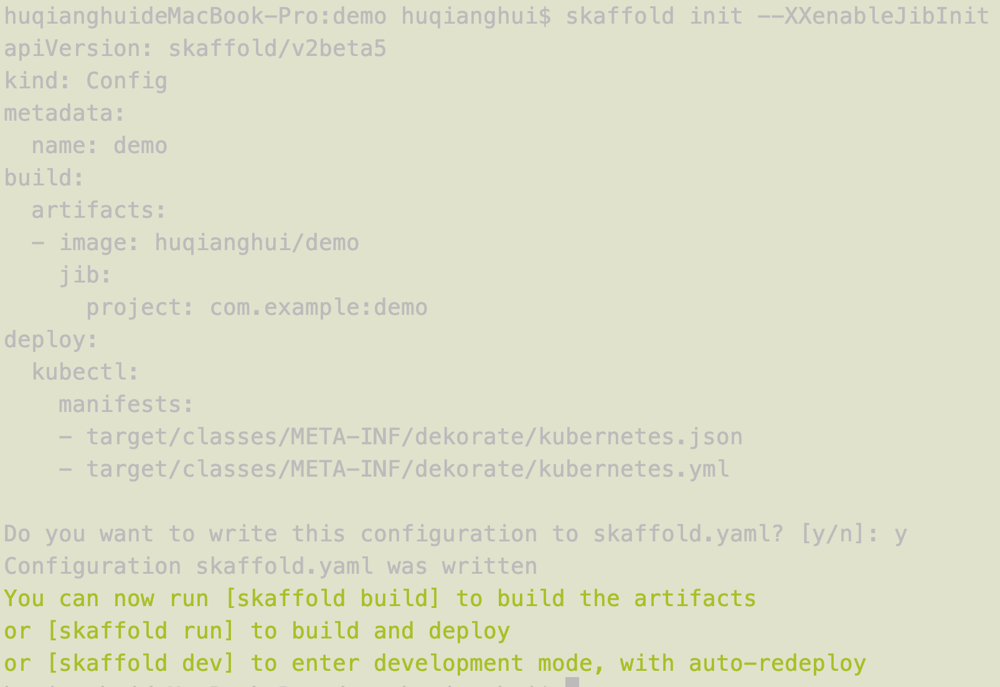
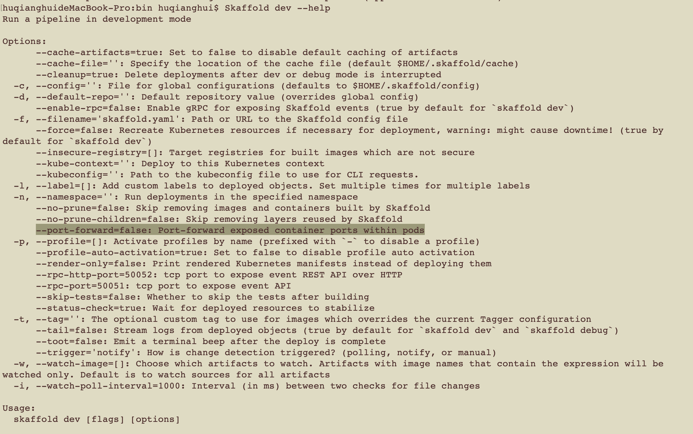
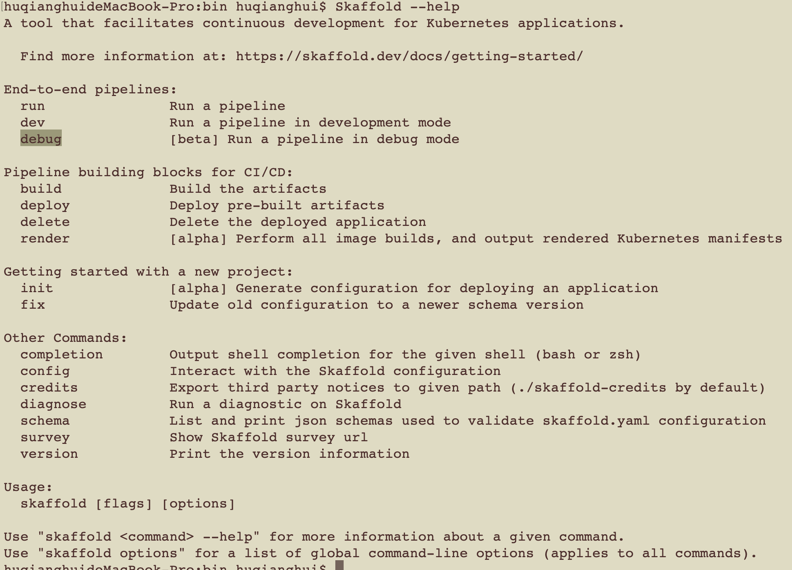

# Skaffold-简化本地开发kubernetes应用

Skaffold 是谷歌开源的简化本地 Kubernetes 应用开发的工具。

1. 它将构建镜像、推送镜像以及部署 Kubernetes 服务等流程自动化，可以方便地对 Kubernetes 应用进行持续开发。其功能特点包括
2. 没有服务器组件
3. 自动检测代码更改并自动构建、推送和部署服务
4. 自动管理镜像标签
5. 支持已有工作流
6. 保存文件即部署

在kubernetes开发自动化工具领域，还有一些其他的选择，
比如Azure的Draft、Datawire 的 Forge 以及 Weavework 的 Flux.
其他微软的Draft是和Helm结合得非常好，不过Skaffold当然也是支持的，能提升效率的就是好工具.

## Skaffold的特点

1. 没有服务器端组件，所以不会增加你的集群开销

2. 自动检测源代码中的更改并自动构建/推送/部署

3. 自动更新镜像TAG，不要担心手动去更改kubernetes的 manifest 文件

4. 一次性构建/部署/上传不同的应用，因此它对于微服务同样完美适配

5. 支持开发环境和生产环境，通过仅一次运行manifest，或者持续观察变更

## Skaffold是一个可插拔的架构，允许开发人员选择自己最合适的工作流工具



## Skaffold主要使用命令

1. skaffold init
    Skafflod通过发现本地文件夹文件来生成自己的配置文件，本地的工程要提供一个DockerFile或者Jib的maven-plugin
    （one or more valid builder configuration (Dockerfile or Jib configuration) must be present to build images with skaffold; please provide at least one build config and try again or run `skaffold init --skip-build`
    ）

    如果本地工程没有deploy，service之类的文件，它同样也会提示错误信息，表示需要mainifest文件。
    这种时候通过配合dekorate，先build生成对应的文件。这个时候Skaffold就可以检测到相应的manifest文件，进行override

    

    最后会默认生成对应的skaffold.yaml文件，如下：

    ```yaml
    apiVersion: skaffold/v2beta5
    kind: Config
    metadata:
    name: demo
    build:
    artifacts:
    - image: huqianghui/demo
        jib:
        project: com.example:demo
    deploy:
    kubectl:
        manifests:
        - target/classes/META-INF/dekorate/kubernetes.json
        - target/classes/META-INF/dekorate/kubernetes.yml
    ```

2. skaffold dev

    skaffold dev类似nodeJs的watch 功能。
    从文件的编译，打包，生成镜像，发布到kubernetes集群，同时映射log到本机。
    同时监视文件的变化，把上面流程循环触发。

    1）Build（构建）

    代码变更后，首先就要执行构建阶段，Skaffold原生支持几种不同的构建镜像的工具。比如Dockerfile、Jib Maven and Gradle、Bazel、Cloud Native Buildpacks以及Custom Script。在skaffold.yaml

    2）Test（测试）

    在构建阶段构建好的镜像部署到K8s集群之前要进行验证，Skaffold支持执行container-structure-tests测试，这个测试主要验证容器镜像的结构完整性，前提是container-structure-tests的程序需要安装。

    3）Tag（标签）

    测试通过的容器镜像就可以执行打标签操作了。Skaffold支持几种不同的打标签策略，这个标签策略tagPolicy可以在skaffold.yaml文件里指定。

    gitCommit：使用git commit ID作为标签。

    sha256：使用sha256哈希值作为标签。

    envTemplate:使用环境变量的值作为标签。比如{{.RELEASE}}-{{.IMAGE_NAME}}

    dateTime：使用时间戳作为标签。

    4）Render（渲染）

    Skaffold deployer会用打好标签的镜像名称替换Kubernetes manifests里的镜像名称，Kubernetes manifests文件就是上面的k8s-*.yaml文件。

    5）Deploy（部署）

    Skaffold deployer利用新生成的Kubernetes manifests部署到Kubernetes集群中。就可以根据变更的版本进行验证了。

    除了上面五个阶段外，Skaffold还提供其他附加功能，比如监控文件变化、文件同步、查看log和端口转发。

    同时有很多运行参数，可供配置，比如 --port-forward等
    

3. skaffold run 只是跑一次，不支持类似上述热部署功能。

4. 更多功能可以参考Skaffold help
