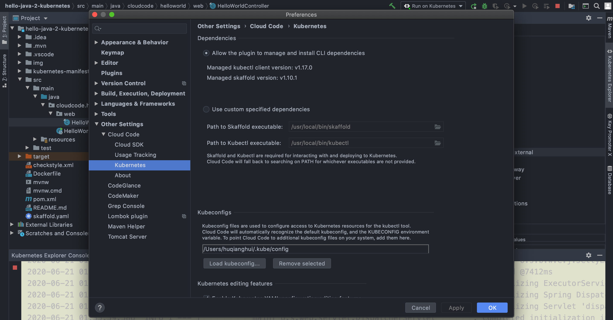
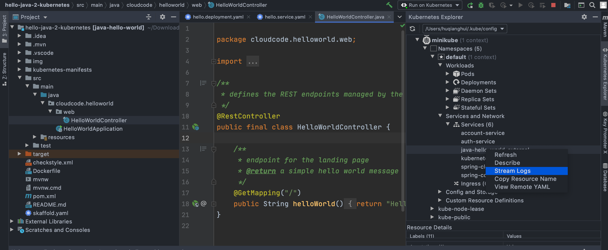

# 使用 Cloud Code 运行 Kubernetes 应用

1. 在inteliJ或者vs code里面安装 cloud code插件（Google提供）

2. 本地运行的话，修改环境path比如: /etc/path等系统级别文件。（修改用户配置文件： ~/.bash_profile无效）

3. 创建一个新工程，project new 选在cloud code 的模板工程。（自动创建对应的配置文件 + skaffold之类的配置）

4. 点击运行在kubernetes上，便可以通过kubernetes explorer里面查看各个级别的stream log和状态来监视这个应用

