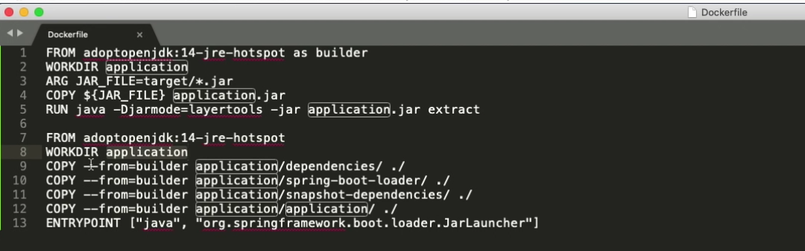

# dive 查看image的内容，实现对image的优化

https://github.com/wagoodman/dive

## install

mac： brew install dive

## dive功能

1. 通过分层显示image内容

2. 申明每层的修改内容

3. 估计每层的消耗

4. 快速构建
构建的镜像的同时，显示内容
dive build -t some-tag  

5. 与CI的集成
dive <your-image> --source <source>

## dive指导多层的dockerfile的编写

Buildpacks多层依赖：
1）依赖
2）spring-boot loader
3）Snap-shot dependency
4）公司级别dependency
5）application

使用buildpacks，dockerfiles和jib插件，这些都是创建Docker镜像的方法。每种方法都有其优点和缺点，但是希望无论选择哪种方法，在Spring Boot 2.3中提供的新功能都将有所帮助。
