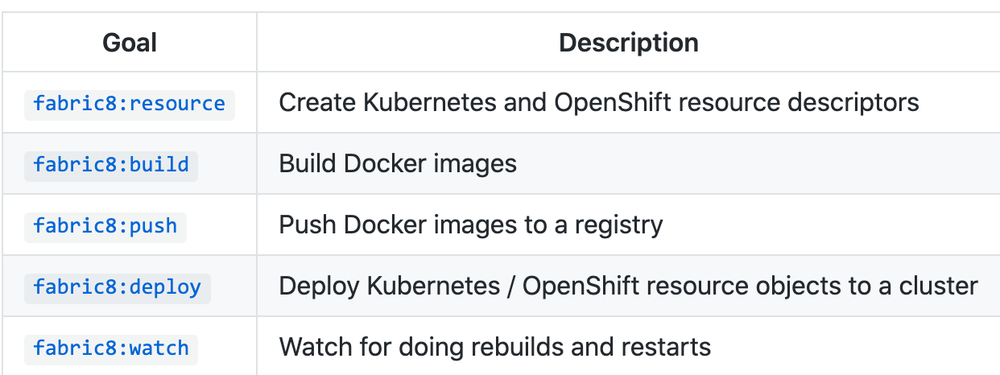

# fabric maven plugin

***注意插件和对应平台的版本支持***

1. fabric8io的插件不仅支持通过dockerfile和docker-compose文件进行docker镜像构造(build),镜像推送(push),还支持对容器操作(如run,stop,remove等),也就是说它可以实现对Docker从构建镜像到运行和推送完整的控制流程.
在众多docker-maven插件中,fabric8io的docker-maven-plugin毫无疑问是最强大的.

2. 同时Kubernetes和OpenShift的Java应用程序的one-stop-shop。 它将Java应用程序带到Kubernetes和 OpenShift。 它提供了 Maven的紧密集成，并从已经提供的构建配置中获益。 
它专注于三个任务：

1） 生成 Docker 映像

2）创建OpenShift和Kubernetes资源

3）在Kubernetes和OpenShift上部署应用程序

## 文档地址

1. github地址： https://github.com/fabric8io/fabric8-maven-plugin

2. 详细使用文档：http://maven.fabric8.io/

3. 官方网址：http://fabric8.io/

## 使用说明

1. pom文件配置（因为fabric8，支持多种平台发布，所以可以通过profile来实现不同平台发布配置等）

```xml
<profile>
<id>kubernetes</id>
<build>
    <plugins>
        <plugin>
            <groupId>io.fabric8</groupId>
            <artifactId>fabric8-maven-plugin</artifactId>
            <version>${fabric8.maven.plugin.version}</version>
            <executions>
                <execution>
                    <id>fmp</id>
                    <goals>
                        <goal>resource</goal>
                        <goal>build</goal>
                    </goals>
                </execution>
            </executions>
            <configuration>
                <enricher>
                    <config>
                        <fmp-service>
                            <type>NodePort</type>
                        </fmp-service>
                    </config>
                </enricher>
            </configuration>
        </plugin>
    </plugins>
</build>
</profile>
```

2. 构建镜像

fabric8-maven-plugin 功能强大，我们在构建镜像时，在默认情况可以不用自定义 Dockerfile，插件会自动的构建。当然为了构建的镜像更合的要求，可以选择自定义 Dockerfile。

```bash
mvn fabric8:build
```

1. 发布

fabric8-maven-plugin 功能强大，我们在发布到kubernetes，正常情况下我们都编写deployment.yml及service.yml文件，但在默认情况可以不用编写这两个文件，会自动生成。当然为了更合的我们的要求，可以选择自定义 这两个文件。在 src/main/fabric8目录下创建xxx-deployment.yml、xxx-service.yml文件.

```bash
mvn fabric8:resource fabric8:deploy
```

1. 命令概括总结

