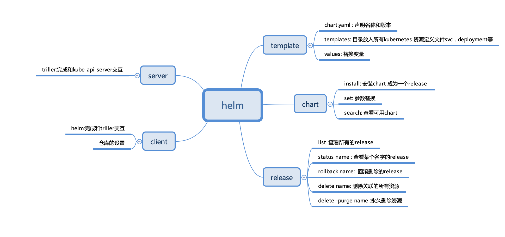

# helm的使用

在kubernetes中，其中几种资源service，deployment，ingress之间其实存在很强的关系，甚至包括PVC等。
但是在kubernetes的默认中，结构很松散，一旦文件太多的话，管理起来比较麻烦。

通过helm可以稍微缓解一下这个问题。

helm通过一个固定文件目录模版，和maven类似。然后定义各种文件，可以实现变量替换，以及把上述资源一起版本管理的方式，
缓解kubernetes的这个痛点。

