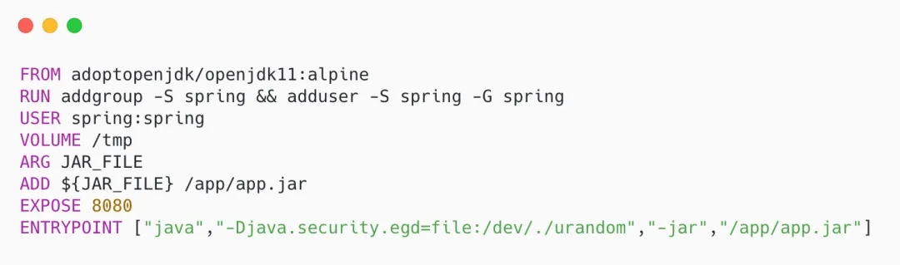
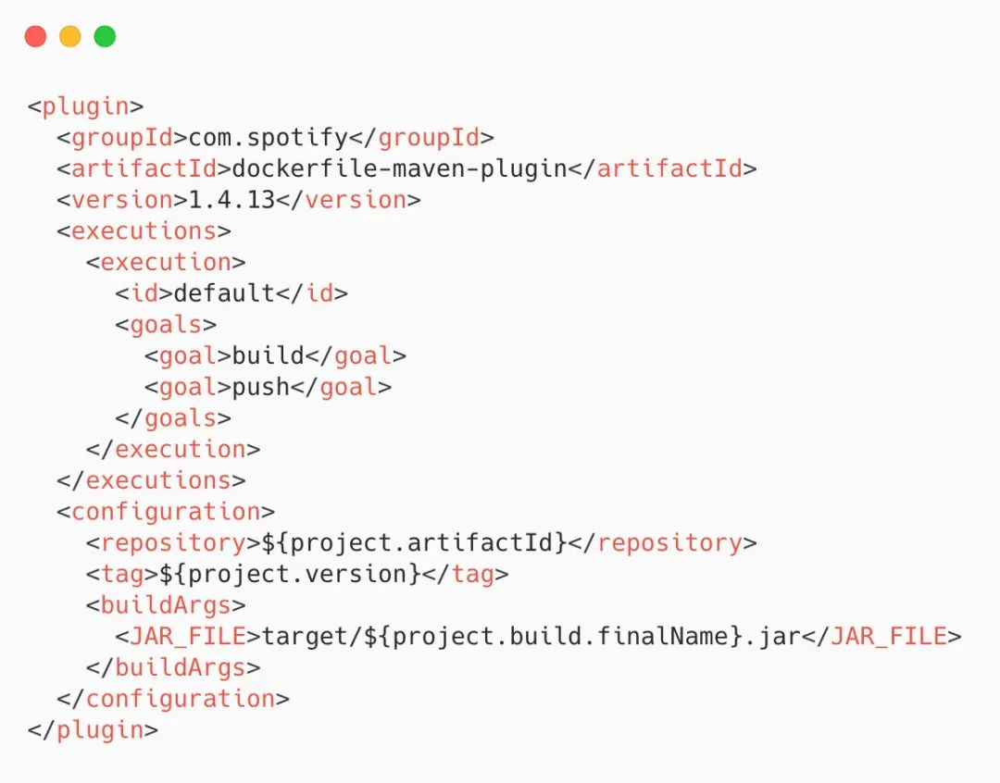

# Java Application的编译成镜像

## jib-maven-plugin（一个可以不需要本地安装docker也不需要DockFile，直接发布到镜像库的插件）

把应用变成镜像是迈向容器化的第一步，可以使用Jib帮助我们简化一下步骤。

Jib有如下几个优点：

1. Jib 是一个快速而简单的容器镜像构建工具，它作为 Maven 或 Gradle 的一部分运行，不需要编写 Dockerfile 或运行 Docker 守护进程。

2. 它从 Maven 或 Gradle 中构建我们的 Docker 镜像, 并只将发生变更的层（而不是整个应用程序）推送到注册表来节省宝贵的构建时间。

可以直接指定不容的docker镜像库，已经认证等。如下的huqianghui/便是docker regstry的目录管理

插件代码：

'''xml
<plugin>
    <groupId>com.google.cloud.tools</groupId>
    <artifactId>jib-maven-plugin</artifactId>
    <version>2.4.0</version>
    <configuration>
    <from>
        <image>adoptopenjdk/openjdk8</image>
    </from>
    <to>
        <image>huqianghui/account-service</image>
        <tags>
            <tag>1.0.0-SNAPSHOT</tag>
        </tags>
    </to>
</configuration>
</plugin>
'''

通过如下几个命令可以完成大部分事情：

1. 打包的镜像直接push到镜像库（可能需要一些网络开销）
   ''' mvn compile jib:build '''

2. 打包镜像到docker deamon里面（可以本地安装一个docker环境，便于本地测试）
   ''' mvn compile jib:dockerBuild '''

3. 打包镜像到一个压缩文件，便于拷贝与传输。
   ''' mvn compile jib:buildTar '''

可以通过docker load --input target/jib-image.tar来加载到docker deamon里面去。

更多可以参考如下地址：

https://github.com/GoogleContainerTools/jib/tree/master/jib-maven-plugin

## Spring Boot maven 插件 的 build-image（不需要写DockerFile，需要Docker）

Spring Boot 预装了自己的用于构建 Docker 镜像的插件，我们无需进行任何更改，因为它就在 pom.xml 中的 spring-boot-starter-parent。

你不需要写 Dockerfile，也不用操别的心，plugin 都帮你做了，例如 Spring 建议的安全、内存、性能等问题。

只需要简单的执行：

mvn spring-boot:build-image

## dockerfile-maven-plugin

这个插件就需要我们写 Dockerfile 了，Domo 项目中已经准备好了。

Dockerfile 需要放在项目的根目录下，和 pom.xml 在一起。

需要在 pom.xml 中添加一些配置，以便指定仓库、tag 标签，还有上面 Dockerfile 中定义的 JAR_FILE。

执行 mvn package 时就会自动构建镜像了，执行完成后就会看到提示信息。