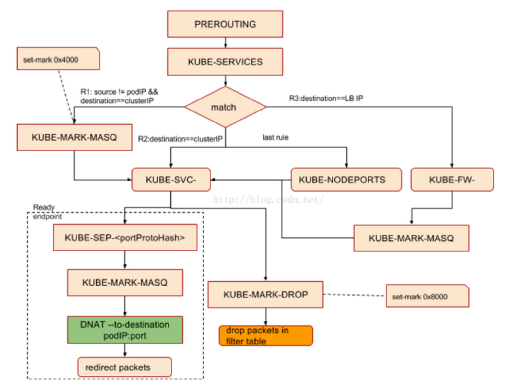

# Service

service是发现后端pod服务，为一组具有相同功能的容器应用提供一个统一的入口地址；将请求进行负载分发到后端的各个容器应用上的控制器。

## 缘由：

集群中的每一个 Pod 都可以通过 podIP 被直接访问的，但是正如我们所看到的，Kubernetes 中的 Pod 是有生命周期的对象，尤其是被 ReplicaSet、Deployment 等对象管理的 Pod，随时都有可能由于集群的状态变化被销毁和创建。
这也就造成了一个非常有意思的问题，当 Kuberentes 集群中的一些 Pod 需要为另外的一些 Pod 提供服务时，我们如何为提供同一功能服务的一组 Pod 建立一个抽象并追踪这组服务中节点的健康状态。

这一个抽象在 Kubernetes 中其实就是 Service，每一个 Kubernetes 的 Service 都是一组 Pod 的逻辑集合和访问方式的抽象，我也可以把 Service 加上的一组 Pod 称作是一个微服务。

## service类型

采用微服务架构时，作为服务所有者，除了实现业务逻辑以外，还需要考虑如何把服务发布到k8s集群或者集群外部，使这些服务能够被k8s集群内的应用、其他k8s集群的应用以及外部应用使用。因此k8s提供了灵活的服务发布方式，用户可以通过ServiceType来指定如何来发布服务，类型有以下几种：

1. ClusterIP：提供一个集群内部的虚拟IP以供Pod访问（service默认类型)
2. NodePort:在每个Node上打开一个端口以供外部访问。
   Kubernetes将会在每个Node上打开一个端口并且每个Node的端口都是一样的，通过\:NodePort的方式Kubernetes集群外部的程序可以访问Service。
3. LoadBalancer：通过外部的负载均衡器来访问

## service selector

service通过selector和pod建立关联。
k8s会根据service关联到pod的podIP信息组合成一个endpoint。
若service定义中没有selector字段，service被创建时，endpoint controller不会自动创建endpoint。

## service负载分发策略

service 负载分发策略有两种：
RoundRobin：轮询模式，即轮询将请求转发到后端的各个pod上（默认模式）；
SessionAffinity：基于客户端IP地址进行会话保持的模式，第一次客户端访问后端某个pod，之后的请求都转发到这个pod上。

## 服务发现

虽然Service解决了Pod的服务发现问题，但不提前知道Service的IP，怎么发现service服务呢？
k8s提供了两种方式进行服务发现：
● 环境变量： 当创建一个Pod的时候，kubelet会在该Pod中注入集群内所有Service的相关环境变量。
需要注意的是，要想一个Pod中注入某个Service的环境变量，则必须Service要先比该Pod创建。这一点，几乎使得这种方式进行服务发现不可用。
● DNS：可以通过cluster add-on的方式轻松的创建KubeDNS来对集群内的Service进行服务发现————这也是k8s官方强烈推荐的方式。为了让Pod中的容器可以使用kube-dns来解析域名，k8s会修改容器的/etc/resolv.conf配置。

### k8s服务发现原理

● endpoint
endpoint是k8s集群中的一个资源对象，存储在etcd中，用来记录一个service对应的所有pod的访问地址。
service配置selector，endpoint controller才会自动创建对应的endpoint对象；否则，不会生成endpoint对象.
● endpoint controller
endpoint controller是k8s集群控制器的其中一个组件，其功能如下：
负责生成和维护所有endpoint对象的控制器
负责监听service和对应pod的变化
监听到service被删除，则删除和该service同名的endpoint对象
监听到新的service被创建，则根据新建service信息获取相关pod列表，然后创建对应endpoint对象
监听到service被更新，则根据更新后的service信息获取相关pod列表，然后更新对应endpoint对象
监听到pod事件，则更新对应的service的endpoint对象，将podIp记录到endpoint中

## 负载均衡 kube-proxy

kube-proxy负责service的实现，即实现了k8s内部从pod到service和外部从node port到service的访问。
kube-proxy采用iptables的方式配置负载均衡，基于iptables的kube-proxy的主要职责包括两大块：一块是侦听service更新事件，并更新service相关的iptables规则，一块是侦听endpoint更新事件，更新endpoint相关的iptables规则（如 KUBE-SVC-链中的规则），然后将包请求转入endpoint对应的Pod。如果某个service尚没有Pod创建，那么针对此service的请求将会被drop掉。

### kube-proxy iptables

kube-proxy监听service和endpoint的变化，将需要新增的规则添加到iptables中。
kube-proxy只是作为controller，而不是server，真正服务的是内核的netfilter，体现在用户态则是iptables。
kube-proxy的iptables方式也支持RoundRobin（默认模式）和SessionAffinity负载分发策略。
kubernetes只操作了filter和nat表。
Filter：在该表中，一个基本原则是只过滤数据包而不修改他们。filter table的优势是小而快，可以hook到input，output和forward。这意味着针对任何给定的数据包，只有可能有一个地方可以过滤它。

NAT：此表的主要作用是在PREROUTING和POSTROUNTING的钩子中，修改目标地址和原地址。与filter表稍有不同的是，该表中只有新连接的第一个包会被修改，修改的结果会自动apply到同一连接的后续包中。

kube-proxy对iptables的链进行了扩充，自定义了KUBE-SERVICES，KUBE-NODEPORTS，KUBE-POSTROUTING，KUBE-MARK-MASQ和KUBE-MARK-DROP五个链，并主要通过为KUBE-SERVICES chain增加rule来配制traffic routing 规则。我们可以看下自定义的这几个链的作用：
KUBE-MARK-DROP - [0:0] /*对于未能匹配到跳转规则的traffic set mark 0x8000，有此标记的数据包会在filter表drop掉*/
KUBE-MARK-MASQ - [0:0] /*对于符合条件的包 set mark 0x4000, 有此标记的数据包会在KUBE-POSTROUTING chain中统一做MASQUERADE*/
KUBE-NODEPORTS - [0:0] /*针对通过nodeport访问的package做的操作*/
KUBE-POSTROUTING - [0:0]
KUBE-SERVICES - [0:0] /*操作跳转规则的主要chain*/

同时，kube-proxy也为默认的prerouting、output和postrouting chain增加规则，使得数据包可以跳转至k8s自定义的chain，规则如下：
-A PREROUTING -m comment --comment "kubernetes service portals" -j KUBE-SERVICES
-A OUTPUT -m comment --comment "kubernetes service portals" -j KUBE-SERVICES
-A POSTROUTING -m comment --comment "kubernetes postrouting rules" -j KUBE-POSTROUTING

如果service类型为nodePort，（从LB转发至node的数据包均属此类）那么将KUBE-NODEPORTS链中每个目的地址是NODE节点端口的数据包导入这个“KUBE-SVC-”链：
 -A KUBE-SERVICES -m comment --comment "kubernetes service nodeports; NOTE: this must be the last rule in this chain" -m addrtype --dst-type LOCAL -j KUBE-NODEPORTS

 -A KUBE-NODEPORTS -p tcp -m comment --comment "default/es1:http" -m tcp --dport 32135 -j KUBE-MARK-MASQ

 -A KUBE-NODEPORTS -p tcp -m comment --comment "default/es1:http" -m tcp --dport 32135 -j KUBE-SVC-LAS23QA33HXV7KBL

 Iptables chain支持嵌套并因为依据不同的匹配条件可支持多种分支，比较难用标准的流程图来体现调用关系，建单抽象为下图： 
 
 
